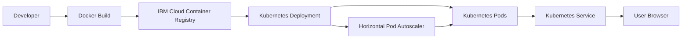

# Guestbook Kubernetes Project


## Overview

This project demonstrates the containerization and deployment of a simple Guestbook web application using Docker, Kubernetes, and IBM Cloud Container Registry. The application consists of a lightweight web interface that allows users to enter and submit text messages. The goal of this project was to practice real-world cloud engineering and DevOps workflows including containerization, container image management, Kubernetes deployments, autoscaling, rolling updates, and version control.

The application is containerized using Docker and served through an NGINX web server. The Docker image is then pushed to IBM Cloud Container Registry where it can be stored and versioned. After that, the application is deployed to a Kubernetes cluster using deployment and service configuration files. Kubernetes manages the Pods and ensures the application remains available and scalable.

To improve scalability and reliability, Horizontal Pod Autoscaling (HPA) is configured to automatically increase or decrease the number of running Pods based on CPU utilization. This allows the application to handle increased demand without manual intervention. The project also demonstrates rolling updates and rollbacks which are important features in Kubernetes that allow new application versions to be deployed safely while maintaining service availability.

During the project lifecycle, multiple deployment versions were created. The initial version of the application displays the default Guestbook interface, while a second version updates the application title and heading to **"Guestbook – v2"**. Kubernetes deployment history is used to track these changes and ReplicaSets are examined to confirm that updates and rollbacks function correctly.

---

## Architecture Diagram



1. The application is packaged into a Docker container.
2. The container image is pushed to IBM Cloud Container Registry.
3. Kubernetes pulls the image and deploys it as Pods.
4. A Service exposes the application.
5. Horizontal Pod Autoscaler scales the application automatically based on CPU usage.

---

## Technologies Used

- Docker
- Kubernetes
- IBM Cloud Container Registry
- HTML
- YAML
- Git
- GitHub
- Visual Studio Code

---

## Project Structure

```
guestbook-kubernetes-project
│
├── app
│   └── index.html
│
├── docker
│   └── Dockerfile
│
├── k8s
│   ├── deployment.yml
│   ├── service.yml
│   └── hpa.yml
│
├── screenshots
│
├── README.md
└── .gitignore
```

---

## Deployment Workflow

1. Build the Docker image

```
docker build -t guestbook:v1 .
```

2. Push the image to IBM Cloud Container Registry

```
docker push <your-container-registry>/guestbook:v1
```

3. Deploy the application to Kubernetes

```
kubectl apply -f k8s/deployment.yml
kubectl apply -f k8s/service.yml
```

4. Enable Horizontal Pod Autoscaling

```
kubectl apply -f k8s/hpa.yml
```

5. Verify running Pods

```
kubectl get pods
```

---

## Key Skills Demonstrated

- Containerization with Docker
- Container image management with IBM Cloud Container Registry
- Kubernetes deployments and services
- Horizontal Pod Autoscaling configuration
- Rolling updates and rollback strategies
- Infrastructure configuration using YAML
- DevOps workflows with Git and GitHub

---

## Author

Thato Rapholo